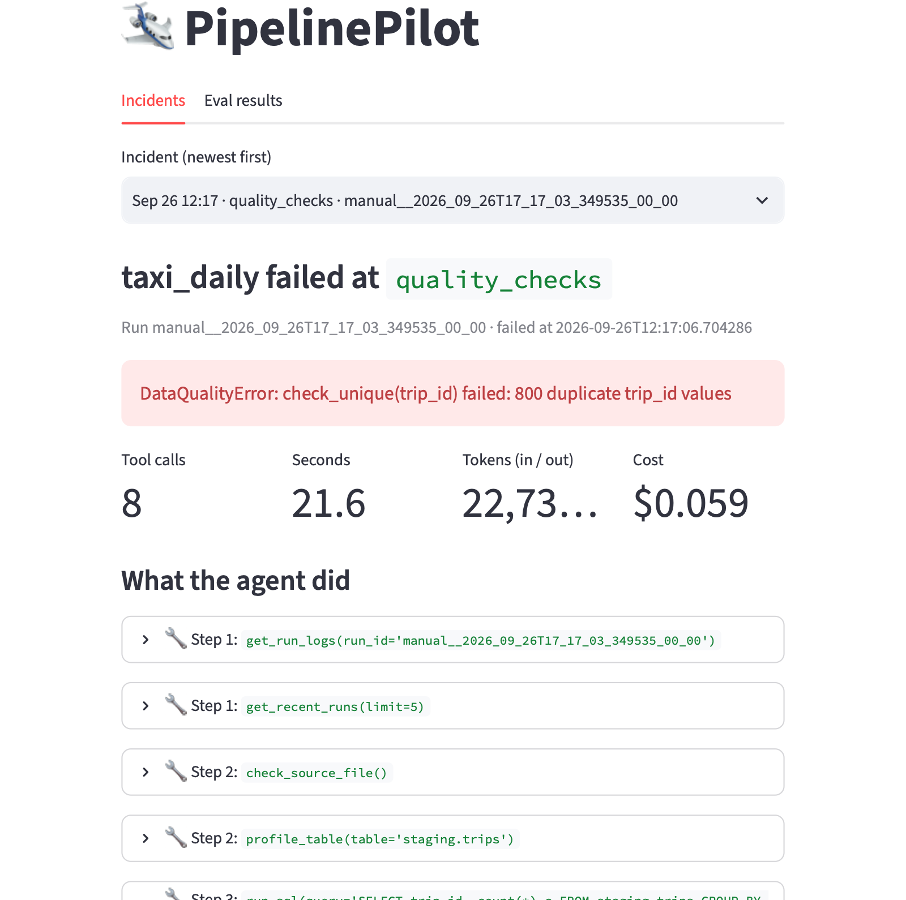
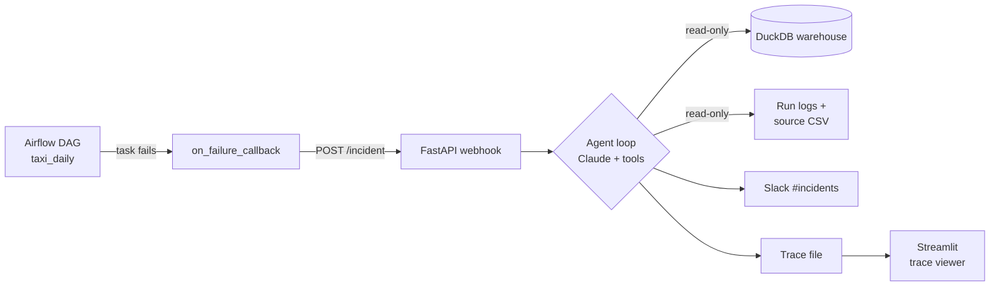
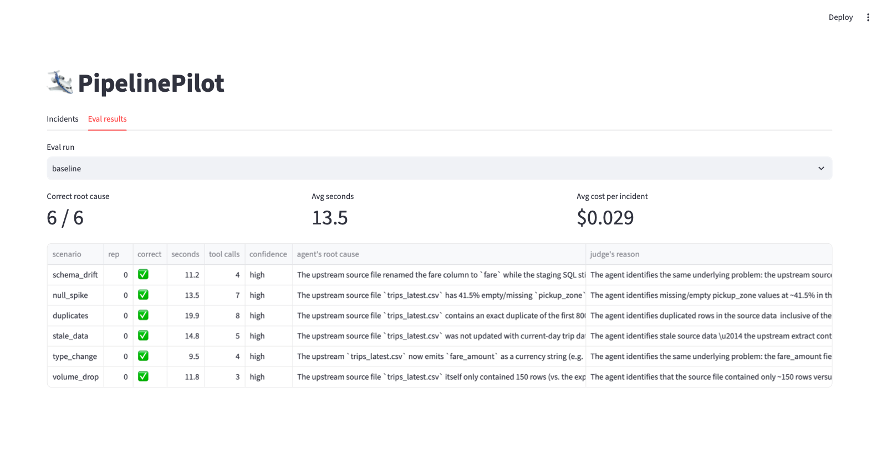

# PipelinePilot

**An AI on-call engineer for data pipelines.** When a pipeline run fails, PipelinePilot investigates
it the way an on-call engineer would (reading logs, checking the source file, querying the warehouse)
and posts the root cause, the evidence and a suggested fix to Slack, usually within 10-20 seconds.
It can only read; any fix waits for a human to approve.

In a pilot eval it found the correct root cause for **6 of 6** injected failure types,
in **9.5-19.9 s**, at about **$0.03 per incident**.



## What a report looks like

This one was posted to Slack automatically after an Airflow task failed (shortened here). Nobody ran anything by hand.

```text
🚨 Incident: taxi_daily failed at step quality_checks

ROOT CAUSE: The upstream source file trips_latest.csv contains 800 fully-duplicated rows
(same trip_id and identical field values), which propagate unchanged through extract and
staging and trip the check_unique(trip_id) quality gate.

EVIDENCE:
- raw.trips (raw CSV load, no transformation) already has 5800 rows but only 5000 distinct
  trip_ids, so the duplication is present at extract time.
- staging.trips shows trip_id=1 appearing twice with byte-for-byte identical values.
- The previous successful run loaded exactly 5000 rows; the new file has 5800 (+800).

SUGGESTED FIX: Fix the upstream export job that writes the duplicate batch; meanwhile add a
dedup step (QUALIFY ROW_NUMBER() OVER (PARTITION BY trip_id ...) = 1) before the check.

CONFIDENCE: high
8 tool calls, 21.6s
```

## Why an agent, not a script

Failures differ, so the right next check depends on what the last one found. For a volume drop the
agent stopped after 3 tool calls because the source file already proved the cause; for duplicates
it used 8 to rule out a pipeline bug. A fixed script would either run every check every time or
miss the unusual case. The agent chooses its next step; the code decides what it is *allowed* to do.

## How it works



1. **Trigger.** An Airflow task fails (or `python -m pipeline.run` fails) and sends a small JSON event:
   pipeline, run id, failed step, error.
2. **Agent loop** ([agent/investigate.py](agent/investigate.py)). Claude gets the event and 8 tool
   descriptions. Each turn it either asks for tools or writes the final report. The code runs the
   tools and sends the results back, for up to 10 turns.
3. **Report.** The final answer follows a fixed format (ROOT CAUSE / EVIDENCE / SUGGESTED FIX /
   CONFIDENCE) and goes to Slack. Every step is saved to a trace file.

### The tools ([agent/tools.py](agent/tools.py))

| Tool | What it returns |
|---|---|
| `get_run_logs(run_id)` | The failed run's log lines |
| `get_recent_runs()` | Recent runs with status, error and row count, to compare against normal |
| `check_source_file()` | Header, row count, sample rows and modified time of the raw CSV |
| `list_tables()` / `get_table_schema(table)` | What is in the warehouse and each table's columns |
| `profile_table(table)` | Row count, null % per column, duplicate ids, time range |
| `get_pipeline_code(step)` | The source (including SQL) of one pipeline step |
| `run_sql(query)` | One read-only `SELECT`, max 100 rows |

### Guardrails, enforced in code rather than in the prompt

- The warehouse is opened `read_only=True`; `run_sql` accepts one `SELECT`/`WITH` statement and
  blocks write keywords (tested in [tests/test_tools.py](tests/test_tools.py)).
- `get_pipeline_code` can read only 4 allow-listed functions, so the agent cannot ask for `.env`.
- The webhook validates events and rejects run ids like `../x` (they are used in file names).
- At most 10 agent turns per incident; alerting has a 5 s timeout and can never crash the pipeline.
- The ground truth used for grading is in a file none of the tools can open.

## Results

Pilot eval ([evals/run_evals.py](evals/run_evals.py)): each run starts from a fresh warehouse, injects
one failure, lets the real agent investigate, and has a separate Claude Opus 5 judge compare the agent's
ROOT CAUSE line with the injected truth. The agent runs on Claude Sonnet 5.

| Failure injected | Correct | Seconds | Tool calls | Cost |
|---|---|---|---|---|
| Column renamed upstream (`schema_drift`) | 1/1 | 11.2 | 4 | $0.024 |
| 40% of a key column empty (`null_spike`) | 1/1 | 13.5 | 7 | $0.032 |
| Same batch delivered twice (`duplicates`) | 1/1 | 19.9 | 8 | $0.046 |
| 3-day-old extract (`stale_data`) | 1/1 | 14.8 | 5 | $0.031 |
| Number arrives as `$7.30` text (`type_change`) | 1/1 | 9.5 | 4 | $0.022 |
| Only 3% of rows arrived (`volume_drop`) | 1/1 | 11.8 | 3 | $0.021 |

Limits: 6 runs is a small sample (95% CI 61-100%); `--reps 5` runs the full 30 (about $1).
The judge grades the root cause, not whether every evidence bullet is true.



## What went wrong along the way

The full log is in [DEVLOG.md](DEVLOG.md). The short version:

- **Confidently wrong on day 1.** On the first schema-drift run the agent saw that the source column
  was now `fare`, but it couldn't see the pipeline's SQL, so it guessed "alias ordering bug", "proved"
  it with its own query and said *high* confidence. Adding a `get_pipeline_code` tool fixed it
  (and made it faster: 6 → 5 tool calls, 27 s → 15 s). An agent is only as good as its tools.
- **Empty reports.** The model thinks before answering, and thinking counts toward `max_tokens`;
  at 2000 the final report was sometimes cut off before any text. Raised the limit and made any
  non-normal stop visible instead of blank.
- **Stale evidence.** Investigating an old failure after the data had been reset produced a
  confident, invented cause. A healthy run and a reset now clear the pending failure.
- **Right answer, wrong fact.** One report cited two *failed* runs as the "normal baseline".
  That is why the eval keeps the evidence limit in view.

## Run it yourself

Requires macOS or Linux, Python 3.11+, [uv](https://docs.astral.sh/uv/), and an Anthropic API key.

```bash
uv venv && source .venv/bin/activate
uv pip install -r requirements.txt
cp .env.example .env                       # add ANTHROPIC_API_KEY (and SLACK_WEBHOOK_URL for Slack)

python -m pipeline.generate_data && python -m pipeline.run    # healthy baseline run
python -m pipeline.break_it schema_drift && python -m pipeline.run   # break it
python -m agent.investigate                # the agent investigates
python -m pipeline.break_it reset          # back to clean data
pytest -q                                  # guardrail tests
```

Failure types: `schema_drift`, `null_spike`, `duplicates`, `stale_data`, `type_change`, `volume_drop`.

**Real time, with Slack.** Start the webhook, then any failed run reports itself:

```bash
uvicorn app.webhook:app --port 8000        # terminal 1
python -m pipeline.break_it duplicates; python -m pipeline.run   # terminal 2
```

**With Airflow** (Docker Desktop + [Astro CLI](https://www.astronomer.io/docs/astro/cli/install-cli)):
`cd airflow && astro dev start`, trigger `taxi_daily` in the UI, break the data, and trigger it again.

**Trace viewer:** `streamlit run app/trace_viewer.py`.
**Eval:** `python -m evals.run_evals --reps 1` (about $0.25) or `--reps 5`.

## Project layout

```text
pipeline/   the "patient": generate_data.py, run.py (ELT + 4 quality checks), break_it.py (6 failures)
agent/      tools.py (read-only tools + guardrails), investigate.py (agent loop)
app/        webhook.py (FastAPI), slack.py, trace_viewer.py (Streamlit)
airflow/    Astro project; dags/taxi_daily.py with on_failure_callback
evals/      run_evals.py (LLM-judged eval), runs/ (results)
tests/      guardrail tests
```

## Tech stack

Python · Claude API (tool use) · DuckDB · Apache Airflow 3 (Astro CLI, Docker) · FastAPI ·
Slack incoming webhooks · Streamlit · pytest

## Next steps

- Run the full 30-run eval and add harder cases (other columns, two failures at once).
- Grade the evidence bullets, not just the root cause.
- Swap the generated data for real NYC TLC taxi trips.
- Let the agent open a pull request with the fix, still behind human approval.
